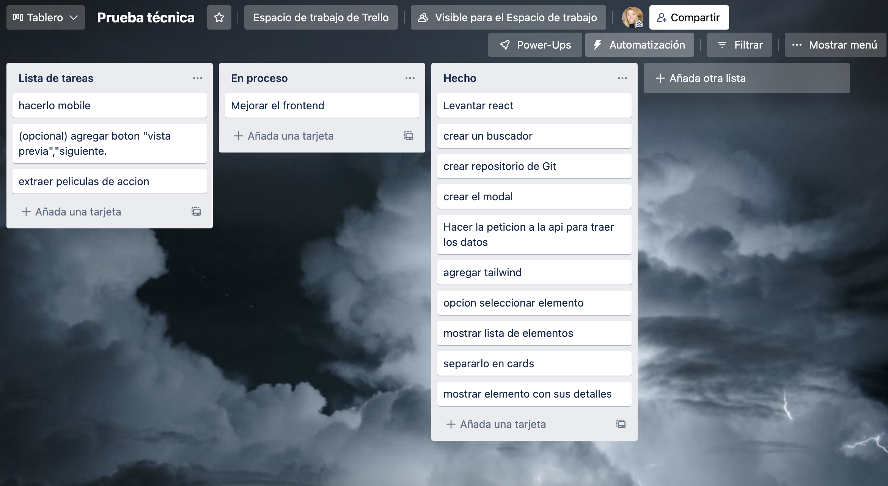

# Prueba técnica Vilma

He creado una aplicación, la cuál te permite filtrar peliculas de Star Wars, como así también tener la posibilidad de seleccionar una de las mismas y consultar su ficha técnica.

## Instalación en local

> En primer lugar debemos clonar el repositorio a nuestra máquina local usando:

https://github.com/CarolinaMarianela/prueba-vilma.git

> Una vez clonado el código, debemos instalar todas las dependencias con el comando:

### npm install

> Una vez hecho instalados todos los paquetes ya se puede levantar la aplicación mediante:

### npm start

> Una vez hecho todo esto ya tendremos nuestra aplicación corriendo en https://localhost:3000.

## Descripción técnica

-El proyecto ha sido creado con React.
-He utilixado la API(https://swapi.dev/).
-Para el CSS he utilizdo "Tailwind" como framework.

## Dificultades encontradas

Como dificultad mayor, y la cuál no he podido concluir ha sido la paginación de las Cards,
como así tampoco, no he podido conseguir cuando se elimina los datos del buscador se vuelvan a pintar todas las cards nuevamente, y por falta de tiempo hacerlo Movile.

## Herramienta de Administracion

He utilizado como herramienta de trabajo "Trello" para ordenar las issues del proyecto.

